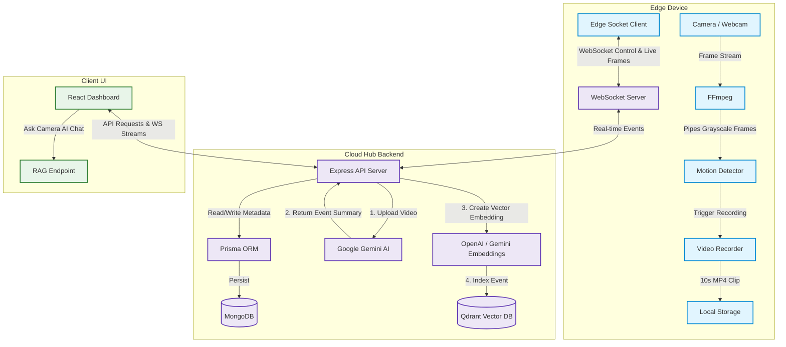

# 👁️ Aura Watch AI

Aura Watch AI is a state-of-the-art, edge-native, AI-powered smart surveillance system. It uses localized edge computing to monitor video feeds, detect motion, and record clips, combined with cloud/hub intelligence to summarize video events using Google Gemini, index event vectors in Qdrant, and provide an interactive AI chat assistant (RAG) to query surveillance history.

---

## 🏗️ System Architecture

Aura Watch AI consists of three core components working in harmony:

1. **Edge Surveillance Agent (`edge/`)**: Lightweight agent running on the camera device (e.g. Raspberry Pi, NVIDIA Jetson, or developer laptop) that performs localized grayscale motion detection and video recording, and connects back to the backend hub via WebSockets.
2. **Cloud Hub Backend (`backend/`)**: Central server that manages device configurations, acts as a WebSocket hub, runs AI video processing pipelines (Gemini Video AI + OpenAI/Gemini Embeddings), and exposes APIs.
3. **Dashboard Frontend (`frontend/`)**: React (Vite + TypeScript) single-page dashboard to configure devices, view live frame feeds, browse recorded clips, see live system logs, and talk to the "Ask Camera AI" assistant.



---

## 📁 Repository Structure

```
camera-active/
├── backend/          # Node.js + Express + WebSocket backend hub
│   ├── prisma/       # MongoDB schema design (EdgeDevice & VideoClip)
│   ├── src/          # Source code (routes, Gemini/OpenAI & Qdrant services)
│   └── storage/      # Temporary storage for video ingestion
├── edge/             # TypeScript edge surveillance client
│   ├── scripts/      # Systemd service creation & deployment utilities
│   ├── src/          # Local motion detection & frame/clip recorder
│   └── storage/      # Local 10-second video clips storage
├── frontend/         # Vite + React + TypeScript + Tailwind CSS UI
│   └── src/          # Main dashboard, interactive RAG panel & stream player
├── package.json      # Monorepo setup scripts & concurrently runner
└── README.md         # Parent level documentation (This file)
```

---

## ⚡ Prerequisites

Ensure the following tools are installed on your target machine(s):

* **Node.js**: `v18.x` or higher
* **FFmpeg**: Required for both camera stream piping and recording.
  * **macOS**: `brew install ffmpeg`
  * **Ubuntu/Debian**: `sudo apt update && sudo apt install ffmpeg`
* **MongoDB**: A running instance or an Atlas connection string.
* **Qdrant Database**: A running local instance or a Qdrant Cloud cluster.
* **API Keys**:
  * **Google Gemini API Key** (Required for video summarization)
  * **OpenAI API Key** (Required if using OpenAI for text embeddings)

---

## 🚀 Getting Started

### 1. Installation

To install all dependencies across the root, backend, frontend, and edge (Python) directories, run the helper script in the root directory:

```bash
npm run install-all
```

#### ⚡ Quick Edge Agent Installer (Single-line Command)
If you are deploying the Edge Agent onto a remote device (e.g. Raspberry Pi, NVIDIA Jetson, or secondary developer computer), you can download, configure, and register it as a background service with a single command:

```bash
sh -c "$(curl -fsSL https://raw.githubusercontent.com/ankur-kushwaha/aura-watch/main/edge/scripts/install.sh)"
```

This interactive script will:
1. Verify system prerequisites (`Python 3`, `git`, `FFmpeg`).
2. Clone the repository to your chosen directory.
3. Prompt you for the Cloud Hub URLs and Device Name (or use env vars when copied from the dashboard).
4. Automatically write the `.env` configuration file and generate a persistent device ID.
5. Install Python dependencies for the edge agent.
6. Start the agent in the background and register it with the Cloud Hub.
7. Option to install as a systemd background service on Linux (interactive mode).

---

### 2. Configuration

You must configure each component using environment variables.

#### 🔸 Backend Configuration

Copy the backend environment template and fill in your keys:

```bash
cd backend
cp .env.example .env
```

Open `backend/.env` and specify:
* `DATABASE_URL`: MongoDB connection URL.
* `QDRANT_URL` & `QDRANT_API_KEY`: Connection info for Qdrant.
* `GEMINI_API_KEY`: Your Gemini API developer key.
* `AI_PROVIDER`: `gemini` or `openai` (used for embeddings/RAG).
* `OPENAI_API_KEY`: OpenAI key (if using `openai` provider).

Run Prisma migrations/db-push to initialize your MongoDB collections:
```bash
npm run prisma:db-push
```

#### 🔸 Edge Agent Configuration

Copy the edge environment template:

```bash
cd ../edge
cp .env.example .env
```

Open `edge/.env` and customize:
* `CLOUD_URL`: API URL of the Cloud Hub (default `http://localhost:5000`).
* `CLOUD_WS_URL`: WebSocket URL of the Cloud Hub (default `ws://localhost:5000`).
* `DEVICE_NAME`: Display name of this camera (e.g. "Living Room Cam").
* *Optional FPS/Resolution adjustments to optimize Gemini bandwidth limits.*

---

### 3. Running the System

You can run the backend and frontend simultaneously from the root directory, and start the edge client independently or register it as a boot service.

#### 💻 Start Backend + Frontend (Development)

From the project root directory, run:
```bash
npm run dev
```
* **Backend Hub** will run on: [http://localhost:5000](http://localhost:5000)
* **Frontend UI Dashboard** will run on: [http://localhost:5173](http://localhost:5173)

#### 🎥 Start Edge Surveillance Agent

If you are running the edge agent in development mode on the same machine (using your webcam):
```bash
# From another terminal tab inside the root
npm run edge
```
Or run directly inside the `edge/` folder:
```bash
cd edge
.venv/bin/python main.py
```

---

## 🛠️ Components In-Depth

### 🔹 Cloud Hub Backend (`backend/`)
* **Live Video Proxying**: Recorded HLS clip files remain stored exclusively on the edge device to optimize storage. When the user requests playback in the frontend UI, the backend proxies files on-demand over WebSocket from the edge.
* **Gemini Ingestion Pipeline**: When a motion event clip completes, the edge uploads it. The backend:
  1. Sends the clip to Gemini (optimized frame rate) for detailed visual summarization.
  2. Commits metadata to MongoDB.
  3. Uses the configured AI provider to create embeddings.
  4. Stores the text vectors in Qdrant for RAG-based search.
* **RAG Assistant**: Exposes `/api/rag/query` which executes a hybrid search on Qdrant + fallback MongoDB and feeds the context to Gemini/OpenAI to generate accurate conversational answers about events.

### 🔹 Edge Agent (`edge/`)
* **Grayscale Motion Tracking**: Analyzes adjacent video frames in grayscale using a threshold config. Reduces CPU and memory footprint on low-power devices.
* **Smart Re-encoding**: Re-encodes clips to low-FPS/optimized resolutions before transmitting them to Gemini to dramatically speed up upload times and reduce API token consumption.
* **Autostart Service (Linux)**:
  Register the edge agent as a systemd background service on system boot:
  ```bash
  cd edge
  chmod +x scripts/setup-service.sh
  ./scripts/setup-service.sh
  ```
  Manage the service using `systemctl`:
  ```bash
  sudo systemctl status aura-watch-edge.service
  sudo systemctl restart aura-watch-edge.service
  ```

### 🔹 Dashboard Frontend (`frontend/`)
* **Real-time Live Stream**: View live camera frames rendered onto a canvas element directly via the active WebSocket channel.
* **Ask Camera AI**: Custom chat window that executes natural language queries against your physical history (e.g., *"Did anyone walk by carrying a box between 2 PM and 4 PM?"*).
* **Remote Settings Controls**: Dynamically toggle motion monitoring state, adjust motion threshold values, and modify pixel change configurations. Updates are pushed immediately to active edge sockets.
