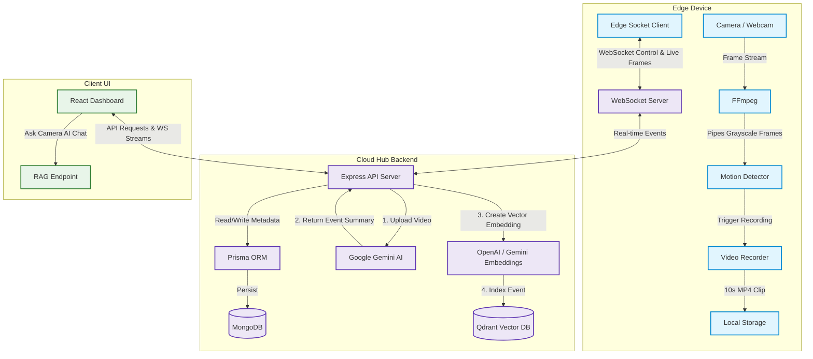

# 👁️ Aura Watch AI

Aura Watch AI is a state-of-the-art, edge-native, AI-powered smart surveillance system. It uses localized edge computing to monitor video feeds, detect motion, and record clips, combined with cloud/hub intelligence to summarize video events using Google Gemini, index event vectors in Qdrant, and provide an interactive AI chat assistant (RAG) to query surveillance history.

---

## 🏗️ System Architecture

Aura Watch AI consists of three core components working in harmony:

1. **Edge Surveillance Agent (`edge/`)**: Python agent running on the camera device (Raspberry Pi, NVIDIA Jetson, or dev laptop). Performs **YOLOv8 + ByteTrack** object detection, records clips on detection, streams live annotated video, and connects to the Cloud Hub via WebSockets.
2. **Cloud Hub Backend (`backend/`)**: Central server that manages device configurations, acts as a WebSocket hub, runs AI video processing pipelines (Gemini Video AI + OpenAI/Gemini Embeddings), and exposes APIs.
3. **Dashboard Frontend (`frontend/`)**: React (Vite + TypeScript) single-page dashboard to configure devices, view live frame feeds, browse recorded clips, see live system logs, and talk to the "Ask Camera AI" assistant.



---

## 📁 Repository Structure

```
camera-active/
├── backend/          # Node.js + Express + WebSocket backend hub
│   ├── prisma/       # MongoDB schema design (EdgeDevice & VideoClip)
│   ├── src/          # Source code (routes, Gemini/OpenAI & Qdrant services)
│   └── storage/      # Temporary storage for video ingestion
├── edge/             # Python edge surveillance agent (YOLO + ByteTrack)
│   ├── scripts/      # Installer, venv setup, systemd, model export
│   ├── main.py       # Edge agent entry point
│   └── storage/      # Local video clips and segment buffers
├── frontend/         # Vite + React + TypeScript + Tailwind CSS UI
│   └── src/          # Main dashboard, interactive RAG panel & stream player
├── package.json      # Monorepo setup scripts & concurrently runner
└── README.md         # Parent level documentation (This file)
```

---

## ⚡ Prerequisites

Ensure the following tools are installed on your target machine(s):

### Cloud Hub (backend + frontend)

* **Node.js**: `v18.x` or higher
* **FFmpeg**: Required for video processing on the hub.
* **MongoDB**: A running instance or an Atlas connection string.
* **Qdrant Database**: A running local instance or a Qdrant Cloud cluster.
* **API Keys**:
  * **Google Gemini API Key** (Required for video summarization)
  * **OpenAI API Key** (Required if using OpenAI for text embeddings)

### Edge device (camera agent)

* **Python 3.10+**, **Git**, and **FFmpeg** — Node.js is **not** required on the edge.
  * See [edge/README.md](edge/README.md) for OS-specific install commands.

---

## 🚀 Getting Started

### 1. Installation

To install dependencies for the **Cloud Hub** (backend + frontend + edge Python venv for local dev):

```bash
npm run install-all
```

This runs `npm install` for backend/frontend and `scripts/setup-venv.sh` for the edge agent.

#### ⚡ Quick Edge Agent Installer (single-line)

Deploy the edge agent to a remote device (Raspberry Pi, Jetson, or secondary computer) with one command:

```bash
sh -c "$(curl -fsSL https://raw.githubusercontent.com/ankur-kushwaha/aura-watch/main/edge/scripts/install.sh)"
```

Or with the production Cloud Hub pre-filled (also used by the dashboard copy button):

```bash
CLOUD_URL='https://aura-watch.adboardtools.com' sh -c "$(curl -fsSL https://raw.githubusercontent.com/ankur-kushwaha/aura-watch/main/edge/scripts/install.sh)"
```

The installer will:

1. Verify prerequisites (`Python 3.10+`, `git`, `FFmpeg`)
2. Clone or update the repo in `~/aura-watch-edge`
3. Prompt for Cloud Hub URL and device name (or use `CLOUD_URL` env for non-interactive mode)
4. Write `.env` and a persistent `.device-id`
5. Create a Python virtual environment (`.venv`) and install dependencies
6. On Raspberry Pi: use lighter `requirements-pi.txt` and CPU-only PyTorch
7. Start the agent and optionally register a **systemd** service (Linux)

> **Re-running the installer** pulls latest code but **overwrites `.env`**. Back up custom settings first. Model export (ONNX/CoreML) is a separate one-time step — see [edge/README.md](edge/README.md#performance-optimization).

Full edge documentation: **[edge/README.md](edge/README.md)**

---

### 2. Configuration

You must configure each component using environment variables.

#### 🔸 Backend Configuration

Copy the backend environment template and fill in your keys:

```bash
cd backend
cp .env.example .env
```

Open `backend/.env` and specify:
* `DATABASE_URL`: MongoDB connection URL.
* `QDRANT_URL` & `QDRANT_API_KEY`: Connection info for Qdrant.
* `GEMINI_API_KEY`: Your Gemini API developer key.
* `AI_PROVIDER`: `gemini` or `openai` (used for embeddings/RAG).
* `OPENAI_API_KEY`: OpenAI key (if using `openai` provider).

Run Prisma migrations/db-push to initialize your MongoDB collections:
```bash
npm run prisma:db-push
```

#### 🔸 Edge Agent Configuration

Copy the edge environment template:

```bash
cd ../edge
cp .env.example .env
```

Open `edge/.env` and customize:
* `CLOUD_URL`: API URL of the Cloud Hub (default `https://aura-watch.adboardtools.com`). WebSocket URL is derived automatically.
* `DEVICE_NAME`: Display name of this camera (e.g. "Living Room Cam").
* *Optional FPS/Resolution adjustments to optimize Gemini bandwidth limits.*

---

### 3. Running the System

You can run the backend and frontend simultaneously from the root directory, and start the edge client independently or register it as a boot service.

#### 💻 Start Backend + Frontend (Development)

From the project root directory, run:
```bash
npm run dev
```
* **Backend Hub** will run on: [http://localhost:5000](http://localhost:5000)
* **Frontend UI Dashboard** will run on: [http://localhost:5173](http://localhost:5173)

#### 🎥 Start Edge Surveillance Agent

If you are running the edge agent locally (webcam or RTSP), set up the venv first:

```bash
cd edge
sh scripts/setup-venv.sh . python3
.venv/bin/python main.py
```

Or from the monorepo root:

```bash
npm run edge
```

Production Cloud Hub: [https://aura-watch.adboardtools.com](https://aura-watch.adboardtools.com)

---

## 🛠️ Components In-Depth

### 🔹 Cloud Hub Backend (`backend/`)
* **Clip Video Proxying**: Recorded clip files remain stored exclusively on the edge device to optimize storage. When the user requests playback in the frontend UI, the backend proxies files on-demand over WebSocket from the edge.
* **Gemini Ingestion Pipeline**: When a motion event clip completes, the edge uploads it. The backend:
  1. Sends the clip to Gemini (optimized frame rate) for detailed visual summarization.
  2. Commits metadata to MongoDB.
  3. Uses the configured AI provider to create embeddings.
  4. Stores the text vectors in Qdrant for RAG-based search.
* **RAG Assistant**: Exposes `/api/rag/query` which executes a hybrid search on Qdrant + fallback MongoDB and feeds the context to Gemini/OpenAI to generate accurate conversational answers about events.

### 🔹 Edge Agent (`edge/`)
* **YOLOv8 + ByteTrack**: Real-time person/vehicle detection and multi-object tracking on the edge device.
* **Platform-optimized inference**: Export to ONNX (Pi), CoreML (Mac), TensorRT (Jetson), or OpenVINO (Intel) for faster FPS — see [edge/README.md](edge/README.md#performance-optimization).
* **Smart Re-encoding**: Re-encodes clips to low-FPS/optimized resolutions before uploading to Gemini.
* **Python virtual environment**: Installed via `scripts/setup-venv.sh` — required on Raspberry Pi OS (PEP 668).
* **Autostart Service (Linux)**:
  Register the edge agent as a systemd background service on system boot:
  ```bash
  cd edge
  sh scripts/setup-service.sh
  ```
  Manage the service using `systemctl`:
  ```bash
  sudo systemctl status aura-watch-edge.service
  sudo systemctl restart aura-watch-edge.service
  ```

### 🔹 Dashboard Frontend (`frontend/`)
* **Real-time Live Stream**: View live camera frames rendered onto a canvas element directly via the active WebSocket channel.
* **Ask Camera AI**: Custom chat window that executes natural language queries against your physical history (e.g., *"Did anyone walk by carrying a box between 2 PM and 4 PM?"*).
* **Remote Settings Controls**: Dynamically toggle motion monitoring state, adjust motion threshold values, and modify pixel change configurations. Updates are pushed immediately to active edge sockets.
